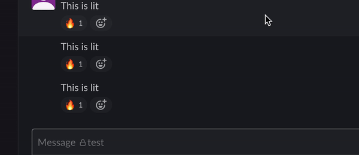

# Reaction bot

Goal of this bot:

- Piss people off in Slack by automatic react to their message in a specific channel.
- Causing confusion sometimes :trollface:

## How to set up

Some where to host this tiny server like Heroku, etc.

Required environment varible:
- CHANNEL_ID - [how to link](https://stackoverflow.com/a/57246565/10666323)
- EMOJI_NAME
- SENTRY_DSN (Don't have to but reccomended)
- SLACK_BOT_TOKEN (You will get this once you install the Slack app to workspace)
- USER_SLACK_ID - [how to link](https://www.workast.com/help/articles/61000165203/)

## Prove that this code works

